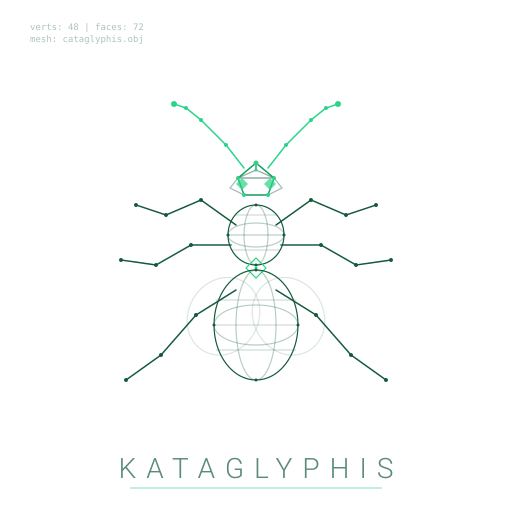
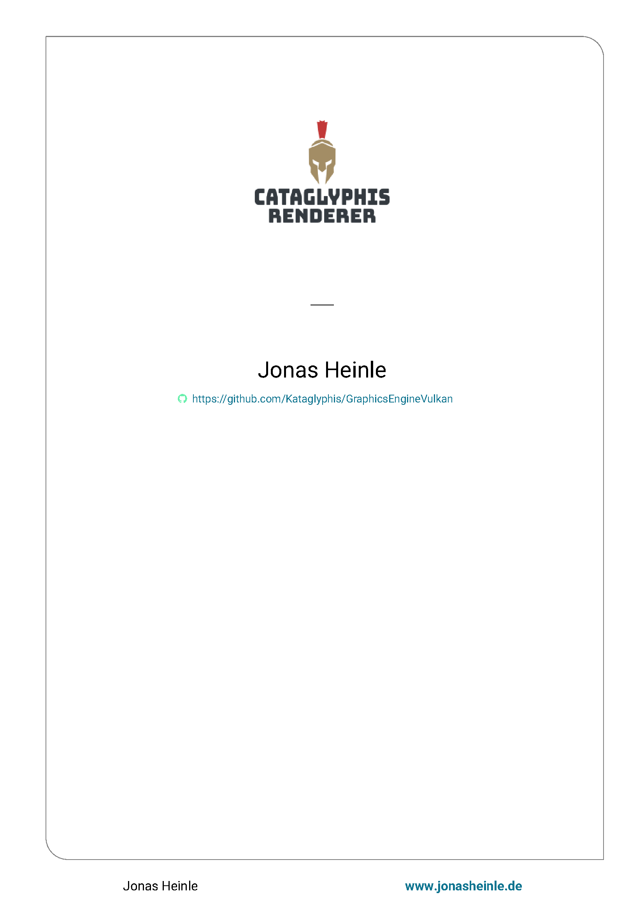
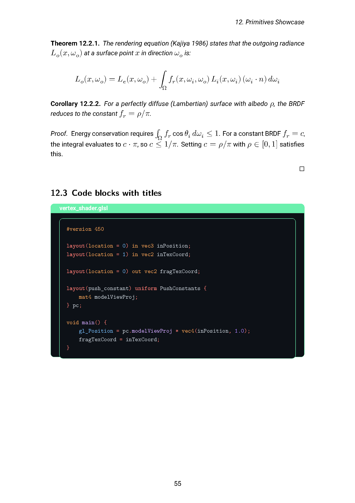
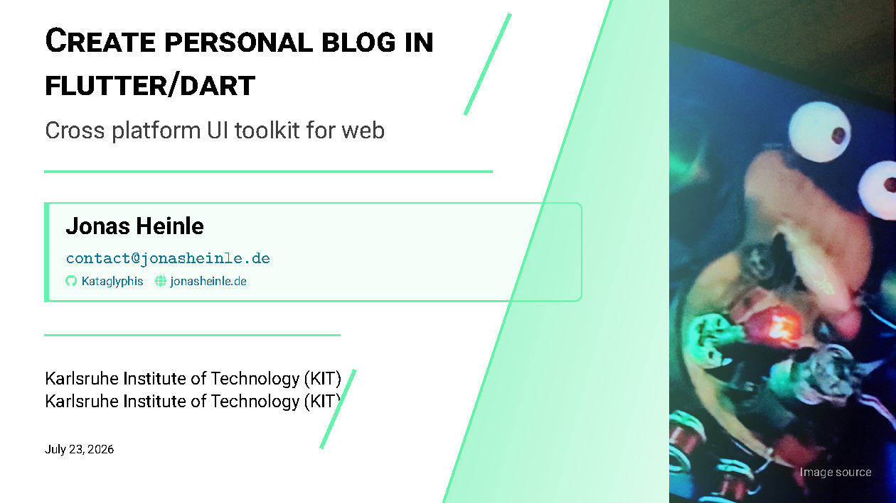
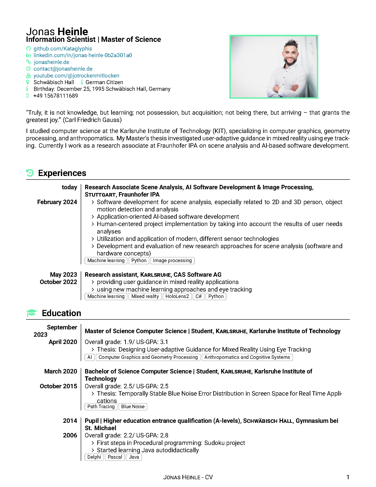

<div align="center">
  <a href="https://jonasheinle.de">
    
  </a>

  <h1>Kataglyphis-DocumANTation</h1>

  <h4>One Markdown source → branded book, slides, PowerPoint and CV. Containerized, reproducible, pixel-perfect.</h4>

  <p>
    <a href="https://kataglyphis.github.io/Kataglyphis-DocumANTation/"><strong>Documentation</strong></a>
    ·
    <a href="#getting-started"><strong>Quick Start</strong></a>
    ·
    <a href="#why-not-just-pandoc"><strong>Why this?</strong></a>
  </p>
</div>

## One brand, four outputs

Write content in Markdown once. Get a print-ready book, a Beamer slide deck, a
PowerPoint deck and a bilingual CV — all sharing the same colours, fonts and
code-block styling, driven from a single `brand.json`.

<p align="center">
  <a href="images/book-title.png"></a>
  <a href="images/book-page.png"></a>
  <a href="images/beamer-slide.png"></a>
  <a href="images/cv-page.png"></a>
</p>

Change one value in `style/brand.json`, run `generate_style.py --write`, and
every output rebrands simultaneously — the PDFs, the PowerPoint, and the Sphinx
documentation website.

## About The Project

Formulate everything in Markdown. Use LaTeX power via Pandoc. Containerized for
reproducibility.

### Key Features

| Feature | Detail |
|---------|--------|
| **Multi-format from one source** | Book (scrbook), Beamer slides, PowerPoint deck, bilingual CV — same Markdown |
| **Brand-consistent code blocks** | `brand.json` → Pandoc + Pygments + LaTeX + CSS — same dark palette everywhere |
| **Containerized builds** | One Dockerfile, SHA-pinned toolchain, zero host dependencies beyond a container runtime |
| **Strict build gates** | `STRICT_WARNINGS=1` turns Pandoc/LaTeX warnings into CI failures |
| **Generated style pipeline** | `generate_style.py` fans `brand.json` into 10+ consumer files; `--check` prevents drift |
| **Reusable Sphinx theme** | `sphinx-kataglyphis-theme` — pip-installable package with brand tokens and Pygments styles |

## Why not just Pandoc?

| | Pandoc + template | Eisvogel | Typst | Kataglyphis-DocumANTation |
|---|---|---|---|---|
| Multi-format from one source | Manual | No | No | Book + Beamer + PPTX + CV |
| Brand-consistent code highlighting | Manual | No | Partial | `brand.json` → all formats |
| Containerized reproducible build | Manual | No | No | One Dockerfile, SHA-pinned |
| Strict build-log warning gates | No | No | No | `STRICT_WARNINGS=1` |
| Bilingual CV from one source | No | No | No | `CV_LANG=english\|german` |
| Sphinx theme with same brand | No | No | No | `sphinx-kataglyphis-theme` |

## Getting Started

### Prerequisites
- **nerdctl** (or docker)
- **buildkitd** running (`systemctl --user status buildkit.service`)

```bash
git clone --recurse-submodules git@github.com:Kataglyphis/Kataglyphis-DocumANTation.git
nerdctl build . -t pandoc_all
```

### Build a document

```bash
./scripts/build_in_container.sh book     # a4paper book, full TeX pipeline
./scripts/build_in_container.sh beamer   # PDF slides
./scripts/build_in_container.sh pptx     # PowerPoint deck, same sources
./scripts/build_in_container.sh cv       # CV; CV_LANG=german for the German one
```

Everything lands in `data/out/` — the CV as `CV_Jonas_Heinle_<language>.pdf`,
both variants from the same sources in `data/cv/`. With `make` installed,
`make {book|beamer|pptx|cv}` and `make cv-all` do the same, and
`STRICT_WARNINGS=1` turns build-log warnings into failures on any target.

### Live demo mode

Edit Markdown and watch the PDF rebuild automatically:

```bash
make watch-beamer    # rebuilds on every .md change
make watch-book      # same for the book
```

Uses `entr` to watch source files. Pair with a PDF viewer that auto-reloads
(e.g., `zathura`, `evince`, or `skim` on macOS) for a live editing experience.

### Build this documentation site

Sphinx builds it on the host, not in the container:

```bash
uv run --extra docs sphinx-build -W -b html docs docs/_build/html
```

The generated HTML lands in `docs/_build/html/`.
The published site is at
[kataglyphis.github.io/Kataglyphis-DocumANTation](https://kataglyphis.github.io/Kataglyphis-DocumANTation/).

> The full guide — what the image contains, driving the container by hand, and
> the per-target compilation stages — is in
> [docs/getting-started.md](docs/getting-started.md) and
> [docs/build-pipeline.md](docs/build-pipeline.md).

## Dependencies

Everything the builds need lives in the `pandoc_all` image built from the
[`Dockerfile`](Dockerfile) — Pandoc, TeX Live, Ghostscript, ImageMagick, uv and
the two vendored LaTeX theme submodules. Nothing has to be installed on the host
but a container runtime.

The full component list, with the version, upstream and license of each, is
maintained in **Kataglyphis-ContainerHub**, which builds this image and is the
single source of truth for every version pin in the toolchain:

- [Third-Party Software & Licenses](https://github.com/Kataglyphis/Kataglyphis-ContainerHub/blob/main/docs/third-party-licenses.md)
  — see the *Documentation Image (`pandoc_all`)* section.

`PANDOC_VERSION` and `UV_VERSION` in this Dockerfile are ARG defaults synced
from ContainerHub's `linux/scripts/01-core/versions.env`; bump them there and
run `python3 docs/scripts/sync_versions.py --write` **in the ContainerHub
checkout** (the script lives there, not in this repo), not by editing this
file.

## Contributing
1. Fork the Project
2. Create your Feature Branch (`git checkout -b feature/AmazingFeature`)
3. Commit your Changes (`git commit -m 'Add some AmazingFeature'`)
4. Push to the Branch (`git push origin feature/AmazingFeature`)
5. Open a Pull Request

## License

Released under the MIT License — see [LICENSE](LICENSE). The third-party
components listed under [Dependencies](#dependencies) keep their own licenses.

## Contact
Jonas Heinle - [@Cataglyphis_](https://twitter.com/Cataglyphis_) - jonasheinle@googlemail.com

Project Link: [https://github.com/Kataglyphis/Kataglyphis-DocumANTation](https://github.com/Kataglyphis/Kataglyphis-DocumANTation)
